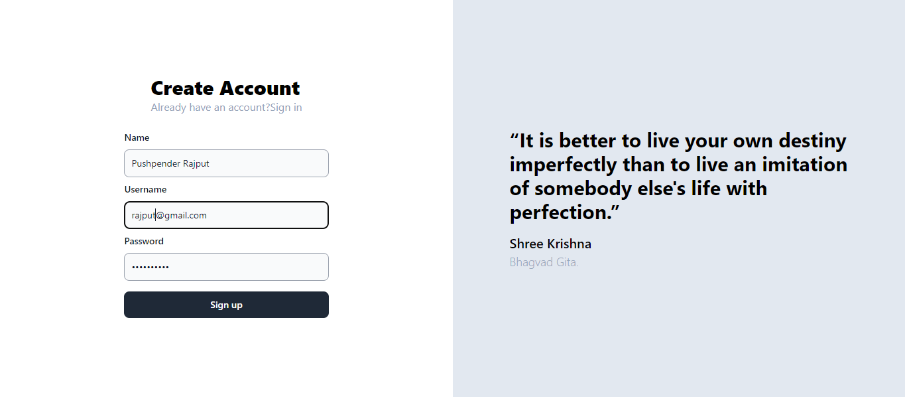
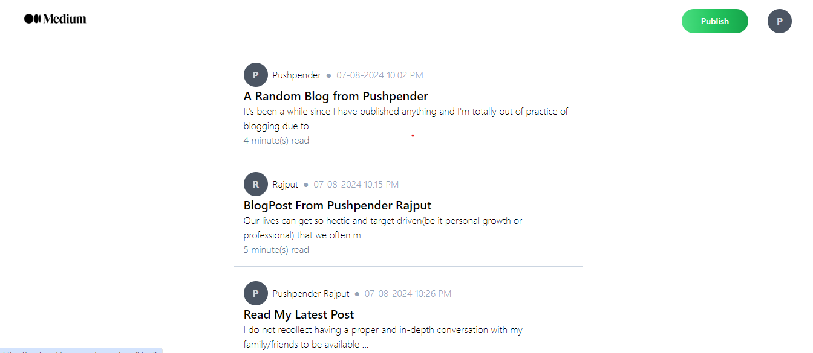
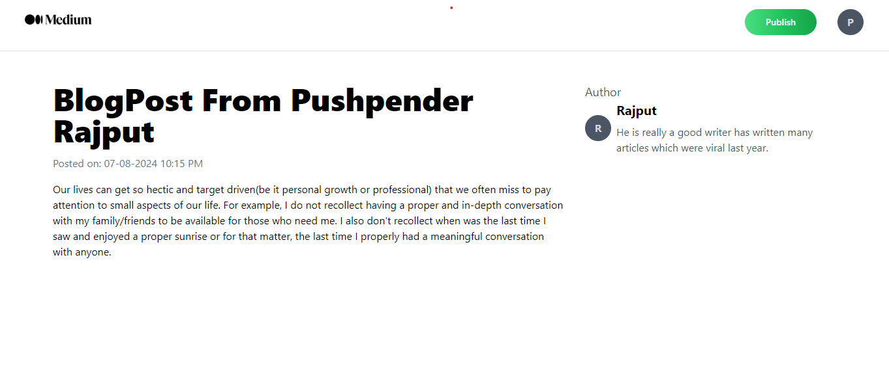

# MediumBlog

A blog website similar to Medium, built with modern technologies.

## Visit

## Technology Stack

* Frontend: React 18.2.0
* Backend: Cloudflare Workers 2022.10.0 
* Validation Library: Zod 3.13.0
* Type Inference: Zod 3.13.0 (for frontend types)
* Language: TypeScript 4.7.4
* ORM: Prisma 4.3.0 (with connection pooling)
* Database: Postgres 14.2
* Authentication: JWT (using jsonwebtoken 8.5.1)

## Getting Started

To get started with this project, follow these steps:

1. Clone the repository: `git clone https://github.com/pushpenderrajput/MediumBlog.git`
2. Install dependencies: `npm install` or `yarn install`
3. Start the development server: `npm run dev` or `yarn dev`

## Screenshots

### Signup Page

### Blogs Page

### Single Blog Page

## Features

* User authentication and authorization using JWT
* Create, read, update, and delete (CRUD) operations for blog posts
* Support for multiple authors and categories
* Responsive design for a great user experience
* SEO-friendly URLs and metadata

## Roadmap

* Implement commenting system
* Add support for image uploads
* Integrate with social media platforms
* Improve performance and scalability

## Acknowledgments

This project was inspired by Medium and uses some of its design elements. We appreciate the work of the Medium team and the open-source community.

## Contact

If you have any questions or need help with the project, please don't hesitate to reach out to us at [pushpenderrajputsp@gmail.com](mailto:pushpenderrajputsp@gmail.com).
